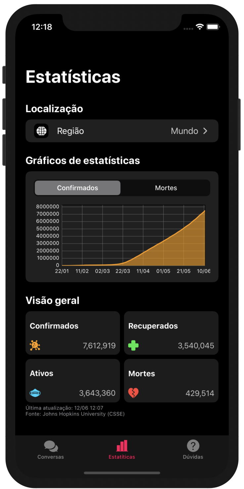

<h1 align="center">
   
  Pandemias 
</h1>

iOS app project to give information about the coronavirus pandemic. The project includes:

- Chatbot to get fast and reliable information
- Charts and statistics that includes the number of infected, recovered, active and deaths cases
- FAQ

Developed by: [Marina Aranha](https://github.com/mariaranha), [Matheus Oliveira](https://github.com/matheussoliveira), [Julia Mestre](https://github.com/JuliaMestre), [Felipe Luna](https://github.com/LunaFelipe)

## Demo
<table>
  <tr>
    <td></td>
    <td></td>
    <td></td>
  </tr>
 </table>
